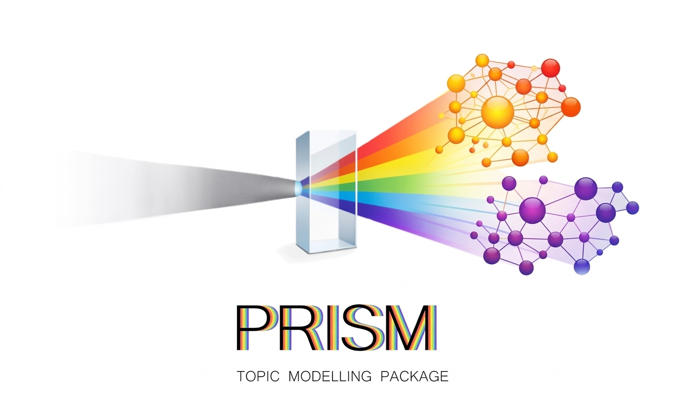

# PRISM – Improving Sentence Embeddings for High-Precision Topics



PRISM is a Python library for fine-tuning local sentence mebdding models for topic modeling with supervision from a *teacher* model
(with current implementation for OpenAI models).

## Installation

From a clone of this repository:

```bash
pip install .
```

Once published to PyPI (name `prism-narrative`):

```bash
pip install prism-narrative
```

Python 3.9+ is recommended.

## Configuring OpenAI

If you want to use the `OpenAITeacher`, configure an API key via
the `OPENAI_API_KEY` environment variable:

```bash
export OPENAI_API_KEY="sk-..."
```

On Windows PowerShell:

```powershell
$env:OPENAI_API_KEY="sk-..."
```

You can also pass `api_key="sk-..."` directly to `OpenAITeacher`.

## Quickstart

```python
import pandas as pd
from prism import Prism, LocalTeacher

# Example data: DataFrame with a Message_en column
df = pd.DataFrame(
    {
        "Message_en": [
            "The product arrived late but support was helpful.",
            "Customer service responded quickly.",
            "The shipment was delayed and the box was damaged.",
            "I love the fast delivery.",
        ]
    }
)

# Use a local teacher by default (no OpenAI key required)
teacher = LocalTeacher()
prism = Prism(df, teacher=teacher)

# Embed and cluster texts
embeddings = prism.embed_texts()
clusters = prism.cluster_texts(distance_threshold=0.8, min_community_size=2)

print("Clusters:", clusters)
flat = prism.get_flat_clusters(clusters)
print("Flat labels:", flat)
```

## API overview

The main entry points are exposed at the top level of the `prism` package:

- `Prism` – core class for embedding, clustering, sampling comparison pairs,
  and fine-tuning sentence-transformer models.
- `OpenAITeacher` – teacher that uses OpenAI models (chat + embeddings).
- `LocalTeacher` – purely local sentence-transformers-based teacher.

Cluster and topic metrics (from `prism.metrics` and re-exported at top level):

- `author_coherence`
- `time_coherence`
- `get_topic_accuracy`
- `count_misclassified_posts`
- `get_topic_coherence`
- `get_topic_diversity`

Evaluation utilities (from `prism.eval`):

- `BinaryROCEvaluator`
- `plot_ROCs`

## Development

Clone the repository and install in editable mode with dev dependencies:

```bash
git clone https://github.com/your-org/PRISM_dev.git
cd PRISM_dev
python -m venv .venv
source .venv/bin/activate  # On Windows: .venv\\Scripts\\activate
pip install -e .[dev]
```

Run tests:

```bash
pytest
```
